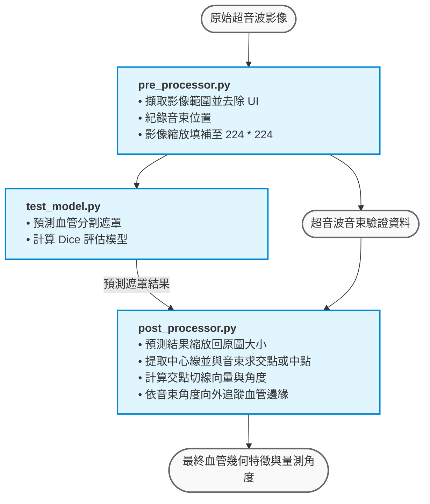

# PW_train

本專案主要負責超音波血管影像的深度學習訓練前後處理與模型驗證流程。主要核心功能包含影像 ROI 擷取、UI 清除、模型預測效能評估（Dice），以及後續的血管中心線與音束交點角度計算。

*備註：本專案僅作為核心演算法流程紀錄，後續將合併至主要的合作開發專案中。*

---

## 模組三大架構

本專案共由三個獨立的 Python 模組（檔案）組成，依序執行完整的訓練與推論工作流：

### 1. Pre-processor (深度學習訓練影像前處理)
負責將原始的超音波影像進行標準化清理與尺寸調整，以符合模型輸入規範，並同步提取驗證所需之關鍵遮罩。
* **擷取超音波影像範圍**：自動偵測並裁切出核心的超音波影像區域，去除多餘的邊界。
* **UI 去除與音束記錄**：移除影像中的使用者介面（UI）文字與圖標，同時精確記錄超音波音束（Ultrasound Beam）的位置，作為後續驗證的基準資料。
* **影像縮放與填補（Padding）**：將裁切與清理後的影像等比例縮放，並透過填補方式統一調整至模型標準輸入尺寸（224 * 224 px）。

### 2. Test Model (深度學習模型驗證)
用於評估與驗證已訓練完成的深度學習模型分割效能。
* **模型預測與驗證**：載入測試資料集，透過深度學習模型進行血管分割（Segmentation）預測。
* **計算 Dice 係數**：比對模型預測結果與 Ground Truth（真實標籤），計算出 Dice 相似係數（Dice Similarity Coefficient），以量化評估模型的準確度。

### 3. Post-processor (深度學習影像後處理與特徵計算)
針對深度學習模型預測出的血管分割結果進行幾何特徵還原與關鍵物理量計算。
* **尺寸還原**：將模型預測出的 224 * 224 遮罩結果，重新縮放回原始輸入影像的實際大小。
* **中心線提取**：計算並擷取預測血管區域的中心線（Centerline）。
* **交點偵測**：尋找血管中心線與前處理階段記錄之超音波音束的交點。
* **極值處理（Fallback 機制）**：若中心線與音束無實質交點，系統將自動以中心線的「中點」作為替代參考點。
* **切線向量計算**：以該交點（或替代中點）為核心，計算出血管中心線的切線向量。
* **角度計算**：根據切線向量，計算出血管與音束或基準線的相對向量角度。
* **血管邊緣追蹤**：依照輸入的超音波音束角度，自交點向外尋找並定位模型預測的血管外緣。

---

## 完整執行流水線 (Pipeline)

